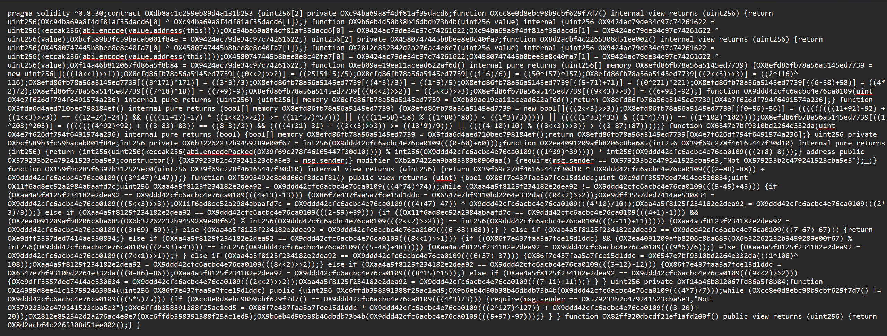

# Smart Contract Obfuscator


> **Giải pháp bảo vệ mã nguồn hợp đồng thông minh (Smart Contract) tiên tiến dựa trên biến đổi cây cú pháp trừu tượng (AST).**

---

## Giới thiệu

Trong thế giới Blockchain, tính minh bạch là một con dao hai lưỡi. Mã bytecode của Smart Contract một khi đã triển khai sẽ công khai vĩnh viễn, tạo điều kiện cho đối thủ hoặc hacker sử dụng công cụ dịch ngược để đánh cắp logic nghiệp vụ độc quyền hoặc tìm kiếm lỗ hổng bảo mật.

Smart Contract Obfuscator ra đời để giải quyết bài toán nan giải này. Thay vì chỉ che đậy bề mặt bằng cách đổi tên biến, BiAn can thiệp sâu vào cây cú pháp trừu tượng, tái cấu trúc lại toàn bộ luồng điều khiển và dữ liệu của chương trình. Mục tiêu của chúng tôi là biến việc đọc hiểu code trở nên tốn kém đến mức phi thực tế đối với kẻ tấn công, bảo vệ chất xám của validator trước khi nó bị sao chép trái phép.

---

## Cơ chế bảo vệ đa lớp

Hệ thống áp dụng chiến lược phòng thủ theo chiều sâu với 3 lớp kiên cố, được thực hiện tuần tự:

### 1️⃣ Control Flow Obfuscation (Làm rối luồng điều khiển)

Mục tiêu: Phá vỡ cấu trúc điều khiển của chương trình, làm sai lệch biểu đồ luồng điều khiển (Control Flow Graph - CFG) mà các công cụ phân tích tĩnh tạo ra.

#### Preprocessing
*   **Khái niệm**: *Inline Expansion & Modularity Destruction*.
*   **Cơ chế**: Hệ thống duyệt AST để xác định các `modifier` và hàm `internal`. Thay vì giữ nguyên cấu trúc gọi hàm, nội dung của chúng được "tiêm" trực tiếp vào vị trí gọi.
*   **Hiệu quả**: Loại bỏ biên giới giữa các hàm, làm tăng đột biến độ phức tạp của hàm đích và xóa bỏ các gợi ý ngữ nghĩa về cấu trúc dự án.

> **Trước**
```solidity
modifier onlyOwner {
    require(msg.sender == owner);
    _;
}
function adminFunc() onlyOwner {
    doSomething();
}
```

> **Sau**
```solidity
// Modifier không còn được sử dụng
function adminFunc() {
    // Logic được nhúng thẳng vào luồng chính
    require(msg.sender == owner);
    doSomething();
}
```

#### Opaque Predicates
*   **Khái niệm**: *Algebraic Number Theory Traps*.
*   **Cơ chế**: Chèn các biểu thức điều kiện dựa trên các tính chất toán học phức tạp (ví dụ: hàm hỗn loạn, lý thuyết số) mà kết quả luôn được xác định trước (luôn đúng hoặc luôn sai) nhưng khó để máy tính chứng minh trong thời gian ngắn.
*   **Hiệu quả**: Tạo ra các cạnh giả trong CFG và các khối dead code. Các công cụ SMT Solver (như Z3) sẽ gặp khó khăn hoặc tốn rất nhiều thời gian để giải quyết các ràng buộc này, dẫn đến việc phân tích bị bế tắc.

> **Trước**
```solidity
if (balance > 100) {
    withdraw();
}
```

> **Sau**
```solidity
if (balance > 100) {
    withdraw();
} else {
    // Dead Branch: Nhánh này về mặt toán học không bao giờ xảy ra
    // Nhưng Decompiler vẫn phải phân tích nó, gây lãng phí tài nguyên
    if ((7*x*x + 3*y) % 13 == 4) {
        fakeRevert();
    }
}
```

#### Control Flow Flattening
*   **Khái niệm**: *State Machine Transformation*.
*   **Cơ chế**: Biến đổi cấu trúc phân cấp của chương trình (cây AST với các khối lồng nhau `if/while/for`) thành một cấu trúc phẳng duy nhất. Toàn bộ logic được gói gọn trong một vòng lặp vô hạn điều khiển bởi biến `state` và một bộ điều phối.
*   **Hiệu quả**: Làm phẳng CFG, biến luồng đi của chương trình thành dạng spaghetti code. Không còn cấu trúc khối rõ ràng, khiến việc khôi phục logic gốc là cực kỳ khó khăn.

> **Trước**
```solidity
function logic() {
    step1();
    if (check) step2();
    else step3();
}
```

> **Sau**
```solidity
function logic() {
    uint state = 1; // Biến trạng thái điều phối
    while (state != 0) {
        // Dispatcher: Điều hướng dựa trên state hiện tại
        if (state == 1) { 
            step1(); 
            state = check ? 2 : 3; // Cập nhật state tiếp theo
        }
        else if (state == 2) { 
            step2(); 
            state = 0; 
        }
        else if (state == 3) { 
            step3(); 
            state = 0; 
        }
    }
}
```

### 2️⃣ Data Flow Obfuscation (Làm rối luồng dữ liệu)

Mục tiêu: Che giấu ý nghĩa và giá trị của dữ liệu đang được xử lý.

#### Local-to-State Promotion
*   **Khái niệm**: *Lifetime Extension & Memory Layout Confusion*.
*   **Cơ chế**: Đưa các biến cục bộ (thường nằm trên Stack) lên thành biến trạng thái (Storage).
*   **Hiệu quả**: Làm loãng không gian trạng thái của Contract. Phá vỡ các thuật toán phân tích luồng dữ liệu cục bộ (như Static Single Assignment - SSA) vì biến giờ đây có phạm vi toàn cục.

> **Trước**
```solidity
function calculate(uint x) public {
    uint temp = x + 10; // Biến stack tạm thời
    result = temp * 2;
}
```

> **Sau**
```solidity
uint256 private __state_temp_0; // Đẩy lên Storage

function calculate(uint x) public {
    __state_temp_0 = x + 10;
    result = __state_temp_0 * 2;
}
```

#### Static Data Obfuscation
*   **Khái niệm**: *Constant Blinding*.
*   **Cơ chế**: Thu thập toàn bộ hằng số (số, chuỗi, bool) và lưu trữ chúng vào một cấu trúc dữ liệu mảng riêng biệt hoặc sinh ra thông qua hàm.
*   **Hiệu quả**: Loại bỏ các dấu hiệu nhận biết trong mã binary, ngăn chặn việc tìm kiếm từ khóa ("grep") hoặc phân tích heuristic.

> **Trước**
```solidity
uint256 fee = 1000;
string memory name = "SecretProject";
```

> **Sau**
```solidity
// Truy xuất gián tiếp qua bảng tra cứu
uint256 fee = __get_int(5); 
string memory name = __get_string(2);
```

#### Boolean Obfuscation
*   **Khái niệm**: *Semantically Equivalent Transformation*.
*   **Cơ chế**: Thay thế các giá trị boolean đơn giản như true/false bằng các đẳng thức hoặc mệnh đề mâu thuẫn phức tạp.
*   **Hiệu quả**: Làm rối các biểu thức logic, buộc người đọc phải giải các bài toán toán học nhỏ để hiểu được điều kiện đơn giản nhất.

> **Trước**
```solidity
bool isValid = true;
if (!isValid) return;
```

> **Sau**
```solidity
// Biểu thức (x^2 + y > 0) luôn đúng với x,y > 0
bool isValid = ((x*x + y) > 0); 
if (!isValid) return;
```

#### Integer Obfuscation
*   **Khái niệm**: *Arithmetic Expansion*.
*   **Cơ chế**: Phân rã một số nguyên thành một cây biểu thức số học (cộng, trừ, nhân, bitwise shift) có cùng kết quả.
*   **Hiệu quả**: Làm rối thị giác và tăng kích thước mã bytecode, gây khó khăn cho việc nhận diện các hằng số cấu hình.

> **Trước**
```solidity
uint x = 10;
```

> **Sau**
```solidity
// 10 = (5 + 7) - 2
uint x = ((5 + 7) - 2); 
```

#### Scalar Variable Splitting
*   **Khái niệm**: *Homomorphic-like Encoding*.
*   **Cơ chế**: Không lưu trữ trực tiếp giá trị biến. Biến `x` được tách thành `x1` và `x2` sao cho `x = x1 ^ x2`. `x1` đóng vai trò là vector nhiễu ngẫu nhiên.
*   **Hiệu quả**: Mã hóa dữ liệu ngay cả khi đang lưu trữ on-chain. Kẻ tấn công đọc trực tiếp Storage Slot cũng chỉ nhận được dữ liệu rác nếu không biết logic tái hợp.

> **Trước**
```solidity
uint256 private salary = 5000;
function setSalary(uint v) { salary = v; }
```

> **Sau**
```solidity
uint256[2] private __scalar_salary; // Mảng 2 phần tử

function setSalary(uint v) {
    uint noise = keccak256(...); // Sinh noise ngẫu nhiên
    __scalar_salary[0] = noise;
    __scalar_salary[1] = noise ^ v; // XOR để mã hóa
}
```

### 3️⃣ Layout Obfuscation (Làm rối giao diện)

#### Comment Removal
*   **Cơ chế**: Sử dụng Regex để quét và xóa toàn bộ chú thích đơn dòng (`//`) và đa dòng (`/* */`).
*   **Hiệu quả**: Loại bỏ mọi thông tin ngữ nghĩa bổ trợ cho con người.

> **Trước**
```solidity
// Hàm này dùng để rút tiền, cần check owner
function withdraw() public { ... }
```

> **Sau**
```solidity
function withdraw() public { ... }
```

#### Format Scrambling
*   **Cơ chế**: Token hóa mã nguồn và tái xây dựng lại với số lượng khoảng trắng tối thiểu, xóa bỏ thụt đầu dòng.
*   **Hiệu quả**: Gây stress thị giác cực độ cho người đọc, biến code thành một khối văn bản đặc.

> **Trước**
```solidity
function add(uint a, uint b) public pure returns (uint) {
    return a + b;
}
```

> **Sau**
```solidity
function add(uint a,uint b)public pure returns(uint){return a+b;}
```

#### Variables Renaming
*   **Cơ chế**: Duyệt AST, định danh tất cả các scope, và thay thế tên biến/hàm bằng chuỗi hash ngẫu nhiên (`OX...`), đảm bảo không trùng lắp.
*   **Hiệu quả**: Xóa bỏ hoàn toàn cầu nối ngữ nghĩa giữa tên biến và chức năng của nó.

> **Trước**
```solidity
function calculateBonus(uint id) {
    uint result = id * 2;
    return result;
}
```

> **Sau**
```solidity
function OX8f2a(uint OXb1) {
    uint OXc9 = OXb1 * 2;
    return OXc9;
}
```

---

## Kiến trúc Pipeline

Dự án thực hiện các bước trên một cách tuần tự và nghiêm ngặt. Sau mỗi bước biến đổi, hệ thống sẽ tái tạo AST ngay lập tức để đảm bảo tính nhất quán cho bước tiếp theo.

```text
    Input(Source Code) --> P(Preprocessing)
    P --> C1(Opaque Predicates)
    C1 --> C2(Control Flow Flattening)
    C2 --> D1(Local-to-State Promotion)
    D1 --> D2(Static Data Obfuscation)
    D2 --> D3(Boolean Obfuscation)
    D3 --> D4(Integer Obfuscation)
    D4 --> D5(Scalar Splitting)
    D5 --> L1(Comment Removal)
    L1 --> L2(Format Scrambling)
    L2 --> L3(Variable Renaming)
    L3 --> Output(Obfuscated Code)
```

---

## Demo Tổng hợp

**Original Code (`test.sol`)**
```solidity
// SPDX-License-Identifier: MIT
pragma solidity ^0.8.30;

contract HelloWorld {
    address public owner;

    constructor() {
        owner = msg.sender;
    }

    // BiAn sẽ phải "bung" cái require này và nhét vào hàm compute bên dưới.
    modifier onlyOwner() {
        require(msg.sender == owner, "Not owner");
        _;
    }

    // BiAn sẽ copy logic (val * 2 + 3) và dán thẳng vào chỗ gọi.
    function _calculateInternal(uint256 val) internal pure returns (uint256) {
        return val * 2 + 3;
    }

    function sayHello() public pure returns (uint) {
        bool a = true;
        uint sum = 0;

        uint x = 1 ^ 1; 
        if (x == 1) {
            a = true;
        } else {
            a = false;
        }

        if (a) {
            sum = 2;
        }

        return sum; 
    }

    uint256 private storedValue; 

    // Thêm modifier và gọi hàm nội bộ
    function compute(uint256 a) public onlyOwner {
        // Thay vì viết công thức trực tiếp, ta gọi hàm nội bộ
        uint256 tmp = _calculateInternal(a); 
        
        storedValue = tmp; 
    }

    function getStoredValue() public view returns (uint256) {
        return storedValue;
    }
}
```

**Obfuscated Code (`test_output.sol`)**



---

## Cài đặt & Sử dụng

### Yêu cầu hệ thống
- **Python**: 3.10 trở lên.
- **Solidity Compiler (solc)**: Phiên bản 0.8.30.

### Cài đặt và thực thi
1.  **Cài đặt**: `pip install py-solc-x`
2.  **Thực thi**: `python demo.py`
3.  **Kết quả**: Kiểm tra `test/test_output.sol`.

---

## Cấu trúc dự án

Để giúp lập trình viên dễ dàng định hướng, dưới đây là cấu trúc thư mục chính của dự án:

```text
smart-contract-obfuscation/
├── src/                    # Mã nguồn chính
│   ├── obfuscator/         # Các module làm rối
│   │   ├── control-flow/   # Preprocessing, Flattening, Opaque Predicates
│   │   ├── data-flow/      # Local-to-State, Scalar Split, Static Data, Boolean Obfuscation, Integer Obfuscation
│   │   └── layout/         # Renaming, Formatting, Comment Removal
├── test/                   # Thư mục kiểm thử
├── demo.py                 # Script điều phối chính
└── README.md               # Tài liệu hướng dẫn
```

---

## Trách nhiệm

Công cụ này được phát triển cho mục đích nghiên cứu và học tập.

*   Tác giả không chịu trách nhiệm cho bất kỳ thiệt hại nào gây ra do việc sử dụng công cụ này vào các mục đích xấu (ví dụ: tạo malware, che giấu hành vi lừa đảo).
*   Mã nguồn sau khi làm rối nên được kiểm tra kỹ lưỡng (audit) trước khi triển khai lên Mainnet. Việc làm rối có thể gây khó khăn cho việc debug và xác minh bảo mật sau này.

---

## Hạn chế & Lưu ý

Việc sử dụng Smart Contract Obfuscator đi kèm với một số đánh đổi kỹ thuật cần phải nắm rõ:

1.  **Phí Gas**: Mã sau khi làm rối sẽ có kích thước lớn hơn và logic phức tạp hơn, dẫn đến chi phí triển khai và thực thi tăng đáng kể (có thể tăng từ 2x - 5x tùy cấu hình).
2.  **Kích thước Contract**: Có thể chạm giới hạn kích thước Contract tối đa (24KB) của Ethereum nếu áp dụng tất cả các lớp bảo vệ lên một Contract quá lớn.
3.  **Không bảo mật tuyệt đối**: Không có phương pháp obfuscation nào là không thể bị đảo ngược. Công cụ này chỉ làm tăng đáng kể chi phí và thời gian của kẻ tấn công, chứ không đảm bảo an toàn 100%.

---

## Tham khảo

Dự án này được lấy cảm hứng và xây dựng dựa trên các kỹ thuật được mô tả trong bài báo nghiên cứu:

*   *BiAn: Static Analysis-Resistant Obfuscation for Smart Contracts* (IEEE/ACM Automated Software Engineering).

---